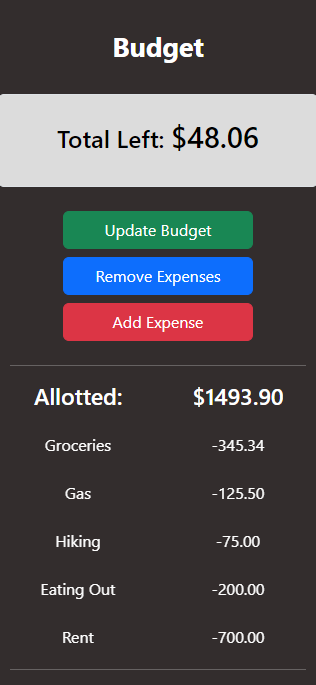
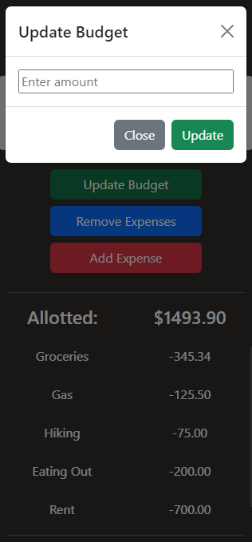
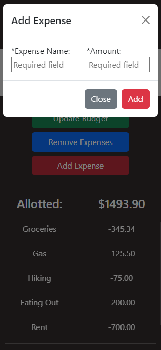

# Budget App &nbsp;&nbsp;

**Name:** Elizabeth Trotter

### Project Scope: 

This was a `single day sprint` challenge where I built out a simple `budget app` that allows you to set a budget and then add expenses. This was a `mobile build` that utilized `vanilla JavaScript`, `HTML`, and the `Bootstrap Framework`. 

- Click :point_right: [here](#mobile-preview) to scroll down to a preview of the budget app in action or check the status badge above to view the deployed website.

> [!IMPORTANT]  
> The project focused on functionality first, meeting the client's requirements, and supplying a working product prior to the deadline. There is opportunity to improve the UI & UX design and responsiveness, if desired. 

***Client Requirements:***

- [x] Have data saved when user returns
- [x] Add or Delete expenses
- [x] Update amounts accordingly
- [x] Track totals
- [x] Use creating elements
- [x] Must use import and export in this challenge
- [x] Tested
- [x] Mobile Build for this application

## Mobile Preview

Figure 1, 2, 3: Mobile preview of budget app in action

